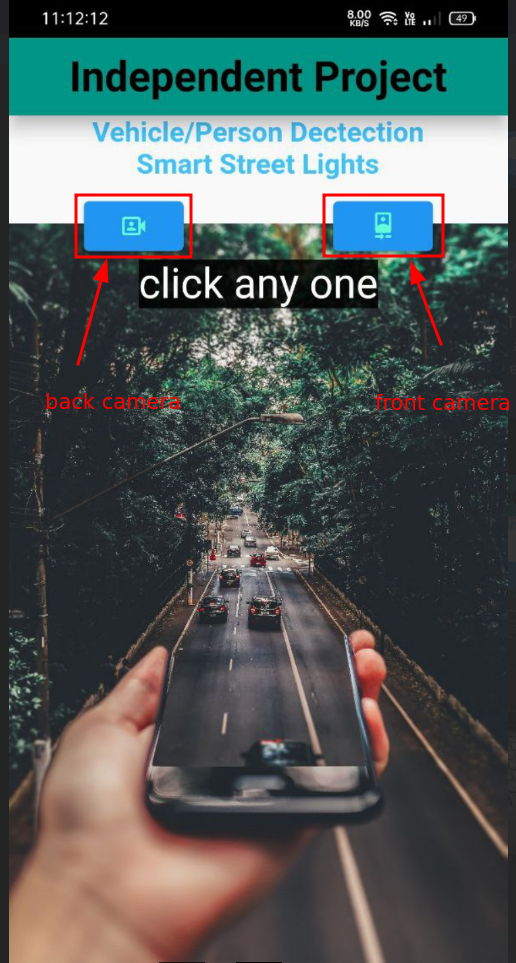
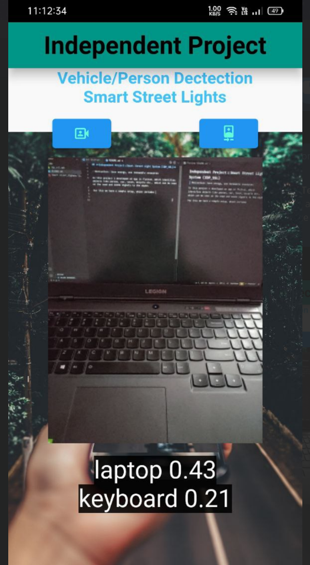

## **Independent Project::Smart Street Light(SSL) System (IDP_SSL)**

In this project i developed an app in flutter, which identifies objects like person, car, truck, bicycle etc.. which can be seen on the road and send signals to the esp32.

Android app code lost in an os crash, soon i will try to upload the code.
#### However download link for android app is available: <a href='https://drive.google.com/file/d/1PvMinsxCqMusVXyXCdIWwdpoSQdQrCSK/view?usp=sharing'>click to get apk</a>
**For this we have a simple setup, which includes:**

1. Esp32 connected through a relay module to an led bulb.
2. Esp32 in wifi mode, where our mobile has to connected to the esp32's wifi.

**How to use:**

1. With the setup completed, open the app, choose to open either front or back camera. point the camera to the object. 
2. One can see the scoring of the probability with which the object can be detected on the screen next to the detected object's name, just below the camera preview. 
3. If that probability is greater than 0.4, idp_ssl app sends signal to the esp32 to turn the light on.
4. For demonstration purposes, the light turns on and goes off after 5 seconds.

***IDP_SSL application preview images:***

